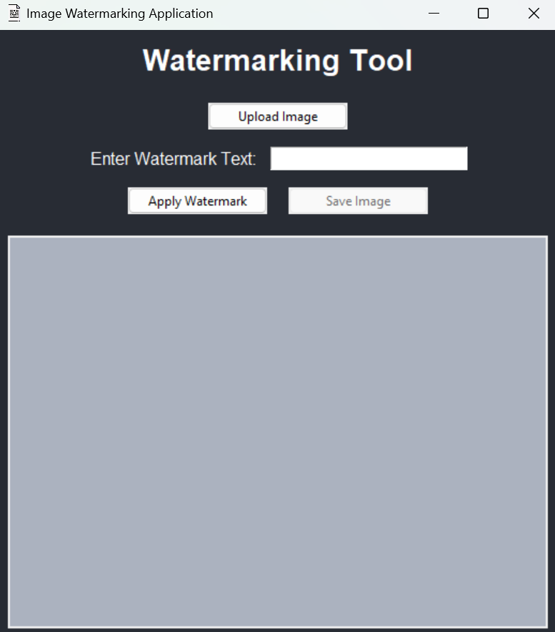

# Image Watermarking Application

## Overview

This is a simple desktop application built with Python and Tkinter that allows users to add watermarks to images. The watermark can be customized with text, and the application applies the watermark diagonally across the image to ensure full coverage. This tool is particularly useful for photographers, content creators, and anyone who wants to protect their images from unauthorized use.

## Features

- **Upload Image**: Supports uploading of various image formats, including PNG, JPEG, BMP, and GIF.
- **Customizable Watermark**: Allows the user to input custom text to be used as a watermark.
- **Diagonal Watermarking**: The watermark text is applied diagonally across the entire image to ensure full coverage.
- **Preview**: Provides a real-time preview of the watermarked image.
- **Save Image**: After applying the watermark, the image can be saved in PNG or JPEG format.

## Requirements

- **Python 3.7+**
- **Pillow**: Python Imaging Library (PIL) fork.
- **Tkinter**: Built-in Python GUI package.

## Installation

1. **Clone the repository**:
    ```bash
    git clone https://github.com/yourusername/image-watermarking-app.git
    cd image-watermarking-app
    ```

2. **Install the required Python packages**:
    ```bash
    pip install -r requirements.txt
    ```
   - If `requirements.txt` is not available, you can manually install Pillow:
    ```bash
    pip install Pillow
    ```

## Usage

1. **Run the application**:
    ```bash
    python main.py
    ```

2. **Using the Application**:
   - Click on "Upload Image" to select the image you want to watermark.
   - Enter your desired watermark text in the text field.
   - Click "Apply Watermark" to preview the watermarked image.
   - Click "Save Image" to save the watermarked image to your desired location.

## Screenshots

### Main Interface


### Watermark Preview


## Future Enhancements

- **Image Resizing**: Add an option to resize images before applying the watermark.
- **Logo Watermark**: Allow users to upload a logo image to be used as a watermark.
- **Watermark Positioning**: Provide options for different watermark positions (center, bottom-right, etc.).

## Contributing

Contributions are welcome! Please feel free to submit a Pull Request or open an Issue to suggest any changes or enhancements.

## License
This project is licensed under the MIT License - see the [LICENSE](LICENSE) file for details.


